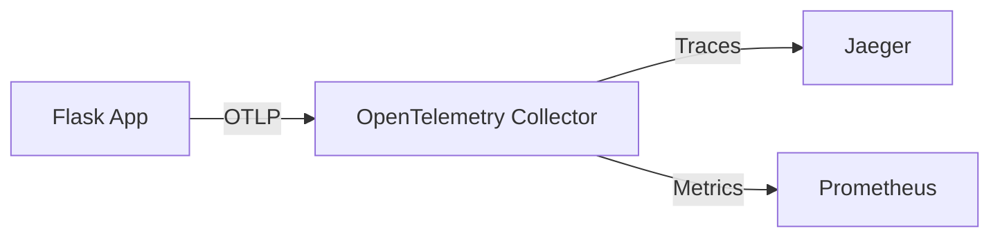

# Entertainment Hub - DevOps Implementation 🚀


A DevOps-focused implementation of an entertainment discovery platform, showcasing modern observability practices with OpenTelemetry and Jaeger.

<div align="center">
  
  
</div>

## 🎯 DevOps Features

- 📊 Distributed Tracing with OpenTelemetry
- 🔍 End-to-End Observability
- 📈 Performance Monitoring
- 🐳 Docker Containerization
- 🌐 Microservices Architecture
- 🔄 CI/CD Pipeline Ready
- 🎭 Environment Configuration
- 📝 Structured Logging

## 🏗️ Technical Architecture



## 🚀 Getting Started

### Prerequisites

- Docker & Docker Compose
- Python 3.8+
- TMDB API key

### Quick Start

1. Clone the repository
```bash
git clone https://github.com/yourusername/entertainment-hub.git
cd entertainment-hub
```

2. Set up environment variables
```bash
cp .env.example .env
# Edit .env with your TMDB_API_KEY
```

3. Launch with Docker Compose
```bash
docker-compose up -d
```

## 🔍 Observability Stack

### OpenTelemetry Integration

The application uses OpenTelemetry for:
- Automatic instrumentation of Flask routes
- HTTP client tracing
- Custom span attributes
- Correlation IDs across services

```python
# Example of custom instrumentation
@app.route('/health')
def health_check():
    with tracer.start_as_current_span("health_check") as span:
        span.set_attribute("service.name", "entertainment-website")
        return jsonify({"status": "healthy"})
```

### Jaeger UI

Access the Jaeger UI at `http://localhost:16686` to:
- View distributed traces
- Analyze performance bottlenecks
- Debug request flows
- Generate dependency graphs


## 🛠️ Configuration

### OpenTelemetry Collector

The collector is configured to:
- Receive OTLP data
- Process and batch telemetry
- Export to Jaeger

Key configuration file: `otel-collector-config.yaml`

### Docker Services

- Web Application: Port 5000
- OpenTelemetry Collector: Port 4318
- Jaeger UI: Port 16686

## 📊 Monitoring Endpoints

- Health Check: `GET /health`
- Metrics: `GET /metrics`
- Jaeger UI: `http://localhost:16686`
- OTEL Collector: `http://localhost:4318`

## 🔄 DevOps Workflow

1. Code changes trigger CI pipeline
2. Automated tests and builds
3. Container image creation
4. Deployment with observability enabled
5. Monitoring and tracing in production

## 📝 License

This project is licensed under the MIT License - see the [LICENSE](LICENSE) file for details.

## 🙏 Acknowledgments

- [OpenTelemetry](https://opentelemetry.io/) for observability framework
- [Jaeger](https://www.jaegertracing.io/) for distributed tracing
- [TMDB](https://www.themoviedb.org/) for movie data API
